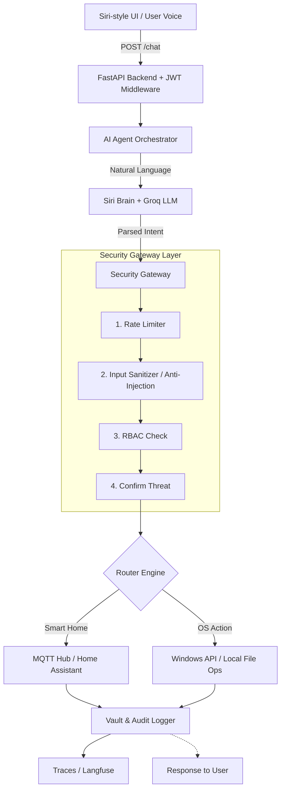

# 🌟 Aisha — AI Smart Agent & Home Hub

Aisha (AI Smart Home Assistant) là một hệ thống AI Agent cá nhân siêu việt, tích hợp giải pháp quản lý nhà thông minh (Smart Home Hub), điều khiển hệ thống máy tính cục bộ (Native System Agent), và bảo vệ kép với cấu trúc Security 6 lớp (Zero-Trust).

Hệ thống được thiết kế bằng **DNA Cosmic Design v3** lấy cảm hứng từ Apple Siri, mang trải nghiệm glassmorphism, orbs animation vào môi trường web và thiết bị di động đa nền tảng.

---

## 📖 1. Giới thiệu

Dự án Aisha được thiết kế để vượt qua ranh giới của một ứng dụng chatbot thông thường. Nó không chỉ là bộ não LLM, mà còn là một **đại lý thực thi (Agent)** có năng lực tương tác vật lý (Điều khiển đèn, quạt, cửa) và năng lực điều hành hệ thống máy tính Windows (Quét registry, mở ứng dụng, tạo file, lấy tọa độ GPS). Mọi request đi vào hệ thống đều phải đi qua **Security Gateway đa lớp** đảm bảo sự an toàn tuyệt đối.

---

## ✨ 2. Tính năng chính

- **🗣️ AI Voice & Natural Language Brain:** Khả năng hiểu ngôn ngữ tự nhiên tiếng Việt thông qua Groq LLM (Mixtral/Llama3). Tích hợp Edge TTS giọng Neural nữ Việt Nam.
- **� SSE Streaming Chat (ChatGPT-style):** Endpoint `POST /chat/stream` trả response từng chunk qua Server-Sent Events. Frontend render text dần với cursor nháy, TTFT < 1s, hỗ trợ `AbortController` hủy stream cũ khi user gửi tin mới.
- **🎙️ Wake-word "Hey Aisha":** Continuous voice detection trên cả browser (Web Speech API) lẫn APK Android (Capacitor `@capacitor-community/speech-recognition` native). Auto-restart 24/7 với watchdog, debounce cooldown 2.5s, 15 phrase variants tiếng Việt.
- **�️ Security Gateway 6 Lớp:** Rate Limiter (Redis Sliding Window + InMemory fallback), Input Sanitizer (chặn 10 pattern prompt injection), Role-based Access Control (Owner/Guest), Rule Engine, Confirmation flow (Redis TTL 60s), và Circuit Breaker.
- **🏠 Smart Home Hub (IoT):** HAClient async REST với **23 service mappings** (light brightness/color, lock, climate temp/HVAC/fan/humidity, fan speed, cover, media_player, input_number, select). Retry exponential backoff + graceful degradation khi HA down.
- **💻 Native System Agent:** Tự động dò tìm đường dẫn phần mềm trên Windows bằng Registry Auto-Discovery, thực thi tác vụ tạo thư mục, ghi file cục bộ. Trình chiếu Pipeline hoạt động qua giao diện cây thời gian thực (Tree Dashboard).
- **📍 Real-time GPS + Reverse Geocoding:** Waterfall 2-tier (Google Maps API → Nominatim) với cache 50m/5min. LLM nhận context vị trí qua system prompt.
- **🔑 Đăng nhập Google OAuth2 & Local Auth:** Chế độ Local JWT Auth (RS256) kết hợp đăng nhập Google an toàn. Quản lý user nội bộ bằng Dashboard riêng biệt.
- **📱 Siri-style UI + APK Android:** Giao diện Dark mode sang trọng với gradient orb, touch target chuẩn mobile. Đóng gói APK qua **Capacitor 6** với 1 lệnh `npm run android:apk` (tự dò IP LAN, build, sync, assemble).
- **🔌 Dynamic Backend URL:** UI Settings ngay trong app cho phép user trỏ frontend tới IP LAN runtime — không cần rebuild APK khi đổi mạng.

---

## 🏗️ 3. Kiến trúc tổng quan

Kiến trúc của Aisha hoạt động qua Pipeline 1 chiều nghiêm ngặt:



---

## 🛠️ 4. Cài đặt

**Yêu cầu hệ thống:**

- Python 3.10+
- Node.js 18+ (Dành cho bản Frontend Development)
- Redis Server (Dành cho Quản lý Rate Limit và JWT Blacklist)
- OS: Windows 10/11 (để tính năng `System Agent` hoạt động chuẩn xác).

**Bước 1: Clone Repository**

```bash
git clone https://github.com/Mimhthuan113/AI_Agent_Grog.git
cd AI_Agent_Grog
```

**Bước 2: Cài đặt Backend**

```bash
python -m venv .venv
# Activate venv:
# Windows: .venv\Scripts\activate
# Linux/Mac: source .venv/bin/activate
pip install -r requirements.txt
```

**Bước 3: Cài đặt Frontend**

```bash
cd frontend
npm install
```

---

## 🚀 5. Chạy project

**Khởi động Redis Server (khuyến nghị nhưng không bắt buộc):**
Đảm bảo Redis chạy ở port `6379`. Nếu thiếu Redis → Rate Limiter và Pending Store sẽ **tự fallback InMemory** (single-process only).

**Khởi động Backend (FastAPI):**

```bash
# Ở thư mục gốc (root) — dùng app factory + bind 0.0.0.0 để mobile/APK truy cập được qua LAN
python -m uvicorn src.api.app:create_app --factory --host 0.0.0.0 --port 8000 --reload
```

**Khởi động Frontend (React + Vite):**

```bash
# Ở thư mục frontend
npm run dev
```

Truy cập Aisha tại: `http://localhost:5173`

---

## ⚙️ 6. Env configuration

Sao chép `.env.example` thành `.env` tại thư mục gốc và điền các khoá quan trọng. **Tất cả biến đã có comment giải thích trong file mẫu** — dưới đây là các biến tối thiểu:

```env
# ── AI Engine
GROQ_API_KEY=gsk_your_groq_api_key_here

# ── JWT RS256 (chạy script tạo key 1 lần)
#    python infrastructure/scripts/gen_jwt_keys.py
JWT_PRIVATE_KEY_PATH=./keys/private.pem
JWT_PUBLIC_KEY_PATH=./keys/public.pem

# ── Admin / Guest
ADMIN_PASSWORD=changeme_strong_password_here
ADMIN_EMAILS=owner@gmail.com,admin@gmail.com   # Email được cấp quyền Owner khi login Google
GUEST_USERNAME=guest
GUEST_PASSWORD=guest123

# ── DB Encryption (AES-256-GCM)
DB_ENCRYPTION_KEY=$(python -c "import secrets;print(secrets.token_hex(32))")

# ── Google OAuth2 (lấy tại https://console.cloud.google.com/apis/credentials)
GOOGLE_CLIENT_ID=your_google_client_id.apps.googleusercontent.com

# ── Redis (optional — fallback InMemory nếu không có)
REDIS_HOST=localhost
REDIS_PORT=6379

# ── Home Assistant (optional — không có HA_TOKEN sẽ fallback mock)
HA_BASE_URL=http://homeassistant.local:8123
HA_TOKEN=eyJhbGciOiJIUzI1NiIs...

# ── CORS (mặc định đã có 3 Capacitor scheme cho APK Android)
CORS_ORIGINS=http://localhost:5173,http://localhost:3000,capacitor://localhost,https://localhost,ionic://localhost
```

**Frontend env** (`frontend/.env` — chỉ cần khi muốn override):

```env
VITE_API_URL=http://localhost:8000
VITE_GOOGLE_CLIENT_ID=your_google_client_id.apps.googleusercontent.com
```

---

## 📱 7. Đóng gói APK Android (Capacitor)

Toàn bộ frontend đã được cấu hình sẵn để build thành APK chạy trên điện thoại Android — gồm cả wake-word "Hey Aisha" native (qua plugin `@capacitor-community/speech-recognition`).

**Yêu cầu môi trường thêm:**

- JDK 21 (Temurin / Oracle)
- Android Studio Hedgehog 2023.1.1+ (cài Platform 34 + Build Tools 34 qua SDK Manager)
- Biến môi trường `JAVA_HOME`, `ANDROID_HOME`

**Build APK debug — chỉ với 1 lệnh:**

```bash
cd frontend
npm install
npx cap add android         # chạy 1 lần đầu — tạo thư mục android/
npm run android:apk         # auto-detect IP LAN → build → sync → assembleDebug
```

APK output tại: `frontend/android/app/build/outputs/apk/debug/app-debug.apk`

**Trỏ APK tới IP LAN của máy chạy backend:**

- **Cách 1 (auto):** `npm run android:apk` đã tự gọi `npm run setup:env` → script `scripts/setup-env.mjs` quét `os.networkInterfaces()` và ghi `frontend/.env.production` với IP ưu tiên `192.168.*` > `10.*` > `172.16-31.*`.
- **Cách 2 (runtime, không cần rebuild):** Mở app → tab **Tài khoản** → mục **🔌 Cấu hình kết nối Backend** → nhập IP rồi bấm 🔍 Test → 💾 Lưu.

Hướng dẫn build chi tiết (release signed APK, troubleshooting, live reload, permissions): xem `docs/ANDROID_BUILD.md`.

---

## 📂 8. Cấu trúc thư mục

```text
├── docs/                 # Tài liệu hệ thống (SKILL_REPORT, ANDROID_BUILD, ...)
├── frontend/             # Root Frontend Code (React 19, Vite 8, Capacitor 6)
│   ├── android/          # (auto-generated bởi `npx cap add android`)
│   ├── capacitor.config.json
│   ├── scripts/
│   │   └── setup-env.mjs # Auto-detect IP LAN ghi .env.production
│   └── src/
│       ├── api/          # client.js + config.js (dynamic API URL)
│       ├── components/   # VoiceOrb (forwardRef + dual-backend)
│       ├── hooks/        # useWakeWord (web + native dispatcher)
│       ├── pages/        # ChatPage (SSE streaming), AccountPage (Settings UI)
│       └── store/        # Zustand store (chat, GPS, auth)
├── infrastructure/       # Container & Script DevOps (Docker, Nginx, gen JWT keys)
├── src/                  # Dịch vụ Backend Cốt lõi (FastAPI)
│   ├── api/
│   │   ├── app.py        # Lifespan context manager
│   │   ├── routes/       # auth, chat (+stream), users, apps, monitor, voice
│   │   └── middlewares/  # JWT RS256 validator
│   ├── core/             # Não bộ điều hành hệ thống
│   │   ├── ai_engine/    # GroqClient (chat + chat_stream), Siri Brain, Agent
│   │   ├── app_actions/  # Windows System Agent (12 providers, auto-discovery)
│   │   ├── location/     # Reverse geocoder (Google + Nominatim fallback)
│   │   └── security/     # Gateway, RBAC, RateLimiter (Redis), PendingStore (Redis), Audit, Vault
│   └── services/
│       └── ha_provider/  # HAClient async REST (23 action mappings)
├── tests/                # Automated Test Suite
│   ├── unit/             # rate_limiter, security, geocoder, groq_keys
│   ├── integration/      # api, chat, siri, injection
│   └── manual/           # bench, tts, voices
└── monitor/              # GUI Tree Dashboard theo dõi pipeline real-time
```

---

## 🤝 9. Hướng dẫn đóng góp (Contributing)

Chúng tôi tuân thủ triệt để [Conventional Commits](https://www.conventionalcommits.org/):

1. **Fork** repository.
2. Tạo **branch mới** từ `main` với tiền tố tên tính năng (VD: `feat/voice-wake-word`, `bug/fix-auth`).
3. Commit message chuẩn theo định dạng (VD: `feat: Thêm mô-đun Wake-word cho hệ thống AI`).
4. **Push** lên fork branch và tạo **Pull Request** về nhánh `main` gốc.
5. Vui lòng đảm bảo không bao giờ commit bất kỳ API Key thực tế hay file test nhạy cảm nào vào Git. Luôn dùng biến môi trường (Environment Variable).

---

## 📄 10. Giấy phép

Mã nguồn được cấp phép theo tiêu chuẩn **[MIT License](LICENSE)**. Bạn hoàn toàn có quyền sao chép, chỉnh sửa và sử dụng cho dự án cá nhân cũng như thương mại, miễn là giữ nguyên chú thích bản quyền gốc.

---

## 🗺️ 11. Roadmap

- [x] **Phase 1:** Phát triển Groq NLP Engine, API tĩnh.
- [x] **Phase 2:** Triển khai Security Gateway (Rate limit, Anti-injection, Circuit Breaker).
- [x] **Phase 3:** Redesign React giao diện "Cosmic Siri", Hỗ trợ Local Accounts CRUD.
- [x] **Phase 4:** Tích hợp OS Native System Agent (Tự tìm ứng dụng, Dò GPS đa luồng, Write/Read files).
- [x] **Phase 5:** Đăng nhập Google Authentication, Binding trạng thái phân quyền.
- [x] **Phase 6:** Kích hoạt đánh thức rảnh tay qua Voice Wake-word ("Hey, Aisha") — dual backend Web Speech API + Capacitor plugin.
- [x] **Phase 7:** Đóng gói Capacitor xuất bản ứng dụng Android (.apk) — đã có script auto + Settings UI cấu hình URL backend.
- [x] **Phase 8:** SSE Streaming chat ChatGPT-style + production-grade Redis (Sliding Window rate-limiter + Pending Store TTL).
- [ ] **Phase 9:** Giao thức WebSocket gửi nhận mệnh lệnh song phương lên phần cứng mạch điện (ESP32).
- [ ] **Phase 10:** Build iOS .ipa + đăng ký TestFlight.
- [ ] **Phase 11:** Voice cloning + multi-language TTS (English/Japanese).
