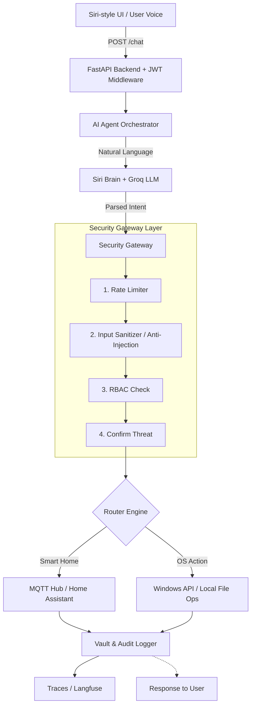

# 🌟 Aisha — AI Smart Agent & Home Hub

Aisha (AI Smart Home Assistant) là một hệ thống AI Agent cá nhân siêu việt, tích hợp giải pháp quản lý nhà thông minh (Smart Home Hub), điều khiển hệ thống máy tính cục bộ (Native System Agent), và bảo vệ kép với cấu trúc Security 6 lớp (Zero-Trust). 

Hệ thống được thiết kế bằng **DNA Cosmic Design v3** lấy cảm hứng từ Apple Siri, mang trải nghiệm glassmorphism, orbs animation vào môi trường web và thiết bị di động đa nền tảng.

---

## 📖 1. Giới thiệu

Dự án Aisha được thiết kế để vượt qua ranh giới của một ứng dụng chatbot thông thường. Nó không chỉ là bộ não LLM, mà còn là một **đại lý thực thi (Agent)** có năng lực tương tác vật lý (Điều khiển đèn, quạt, cửa) và năng lực điều hành hệ thống máy tính Windows (Quét registry, mở ứng dụng, tạo file, lấy tọa độ GPS). Mọi request đi vào hệ thống đều phải đi qua **Security Gateway đa lớp** đảm bảo sự an toàn tuyệt đối.

---

## ✨ 2. Tính năng chính

- **🗣️ AI Voice & Natural Language Brain:** Khả năng hiểu ngôn ngữ tự nhiên tiếng Việt thông qua Groq LLM (Mixtral/Llama3). Tích hợp Edge TTS giọng Neural nữ Việt Nam.
- **🛡️ Security Gateway 6 Lớp:** Rate Limiter, Input Sanitizer (chặn 10 pattern prompt injection), Role-based Access Control (Owner/Guest), Rule Engine, Confirmation flow, và Circuit Breaker.
- **🏠 Smart Home Hub (IoT):** Điều khiển 5 loại thiết bị (Light, Switch, Lock, Climate, Sensor) qua chuẩn giao tiếp MQTT.
- **💻 Native System Agent:** Tự động dò tìm đường dẫn phần mềm trên Windows bằng Registry Auto-Discovery, thực thi tác vụ tạo thư mục, ghi file cục bộ. Trình chiếu Pipeline hoạt động qua giao diện cây thời gian thực (Tree Dashboard).
- **🔑 Đăng nhập Google OAuth2 & Local Auth:** Chế độ Local JWT Auth kết hợp đăng nhập Google an toàn. Quản lý user nội bộ bằng Dashboard riêng biệt.
- **📱 Siri-style UI:** Giao diện Dark mode sang trọng với gradient orb, touch target chuẩn mobile, và responsive app layout.

---

## 🏗️ 3. Kiến trúc tổng quan

Kiến trúc của Aisha hoạt động qua Pipeline 1 chiều nghiêm ngặt:



---

## 🛠️ 4. Cài đặt

**Yêu cầu hệ thống:**
- Python 3.10+
- Node.js 18+ (Dành cho bản Frontend Development)
- Redis Server (Dành cho Quản lý Rate Limit và JWT Blacklist)
- OS: Windows 10/11 (để tính năng `System Agent` hoạt động chuẩn xác).

**Bước 1: Clone Repository**
```bash
git clone https://github.com/Mimhthuan113/AI_Agent_Grog.git
cd AI_Agent_Grog
```

**Bước 2: Cài đặt Backend**
```bash
python -m venv .venv
# Activate venv:
# Windows: .venv\Scripts\activate
# Linux/Mac: source .venv/bin/activate
pip install -r requirements.txt
```

**Bước 3: Cài đặt Frontend**
```bash
cd frontend
npm install
```

---

## 🚀 5. Chạy project

**Khởi động Redis Server:**
Hãy đảm bảo Redis đang chạy trên máy chủ ở port `6379`.

**Khởi động Backend (FastAPI):**
```bash
# Ở thư mục gốc (root)
uvicorn src.api.app:app --reload --port 8000
```

**Khởi động Frontend (React + Vite):**
```bash
# Ở thư mục frontend
npm run dev
```

Truy cập Aisha tại: `http://localhost:5173`

---

## ⚙️ 6. Env configuration

Sao chép file `.env.example` thành `.env` tại thư mục gốc và điền các khoá quan trọng:

```env
# AI Engine
GROQ_API_KEY=gsk_your_groq_api_key_here

# Security
JWT_SECRET=your_jwt_private_key_or_secret
ADMIN_EMAILS=owner@gmail.com,admin@gmail.com # Cấp quyền Chủ nhà 

# AES Encryption Key (Passphrase mã khoá)
AES_PASSPHRASE=thuanbotgiangho

# OAuth2
GOOGLE_CLIENT_ID=your_google_client_id.apps.googleusercontent.com

# Redis Config
REDIS_URL=redis://localhost:6379/0
```

---

## 📂 7. Cấu trúc thư mục

```text
├── docs/                 # Tài liệu hệ thống chi tiết (Architecture, API)
├── frontend/             # Root Frontend Code (React 19, CSS modules)
├── infrastructure/       # Container & Script DevOps (Docker, Nginx)
├── src/                  # Dịch vụ Backend Cốt lõi
│   ├── api/              # API endpoints, middleware cho FastAPI
│   ├── core/             # Não bộ điều hành hệ thống 
│   │   ├── ai_engine/    # Client gọi Groq, xử lý ngữ nghĩa 
│   │   ├── app_actions/  # OS Agent (điều hành Windows)
│   │   ├── security/     # Gateway, RBAC, Crypto, Checksum
│   ├── services/         # HA IoT Providers
├── tests/                # Automated Test Suite tự động
└── monitor/              # GUI Tree Dashboard theo dõi tiến trình OS
```

---

## 🤝 8. Hướng dẫn đóng góp (Contributing)

Chúng tôi tuân thủ triệt để [Conventional Commits](https://www.conventionalcommits.org/):
1. **Fork** repository.
2. Tạo **branch mới** từ `main` với tiền tố tên tính năng (VD: `feat/voice-wake-word`, `bug/fix-auth`).
3. Commit message chuẩn theo định dạng (VD: `feat: Thêm mô-đun Wake-word cho hệ thống AI`).
4. **Push** lên fork branch và tạo **Pull Request** về nhánh `main` gốc.
5. Vui lòng đảm bảo không bao giờ commit bất kỳ API Key thực tế hay file test nhạy cảm nào vào Git. Luôn dùng biến môi trường (Environment Variable).

---

## 📄 9. Giấy phép

Mã nguồn được cấp phép theo tiêu chuẩn **[MIT License](LICENSE)**. Bạn hoàn toàn có quyền sao chép, chỉnh sửa và sử dụng cho dự án cá nhân cũng như thương mại, miễn là giữ nguyên chú thích bản quyền gốc.

---

## 🗺️ 10. Roadmap

- [x] **Phase 1:** Phát triển Groq NLP Engine, API tĩnh.
- [x] **Phase 2:** Triển khai Security Gateway (Rate limit, Anti-injection, Circuit Breaker).
- [x] **Phase 3:** Redesign React giao diện "Cosmic Siri", Hỗ trợ Local Accounts CRUD.
- [x] **Phase 4:** Tích hợp OS Native System Agent (Tự tìm ứng dụng, Dò GPS đa luồng, Write/Read files).
- [x] **Phase 5:** Đăng nhập Google Authentication, Binding trạng thái phân quyền.
- [ ] **Phase 6:** Kích hoạt đánh thức rảnh tay qua Voice Wake-word ("Hey, Aisha").
- [ ] **Phase 7:** Đóng gói Capacitor xuất bản ứng dụng Android (.apk) & iOS.
- [ ] **Phase 8:** Giao thức WebSocket gửi nhận mệnh lệnh song phương lên phần cứng mạch điện (ESP32).
