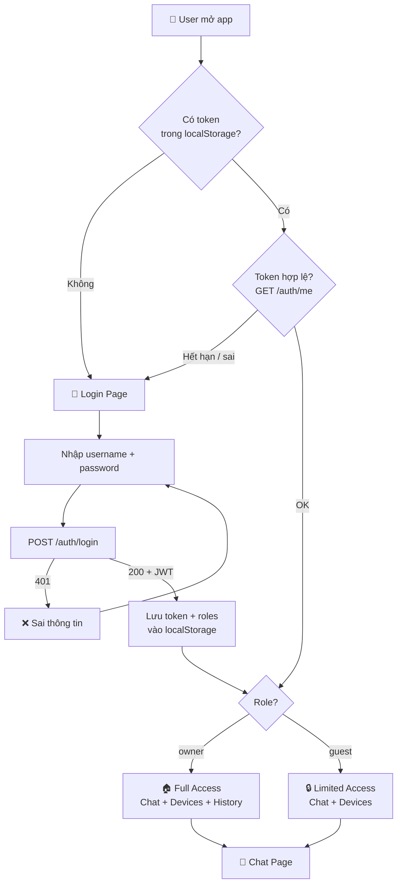
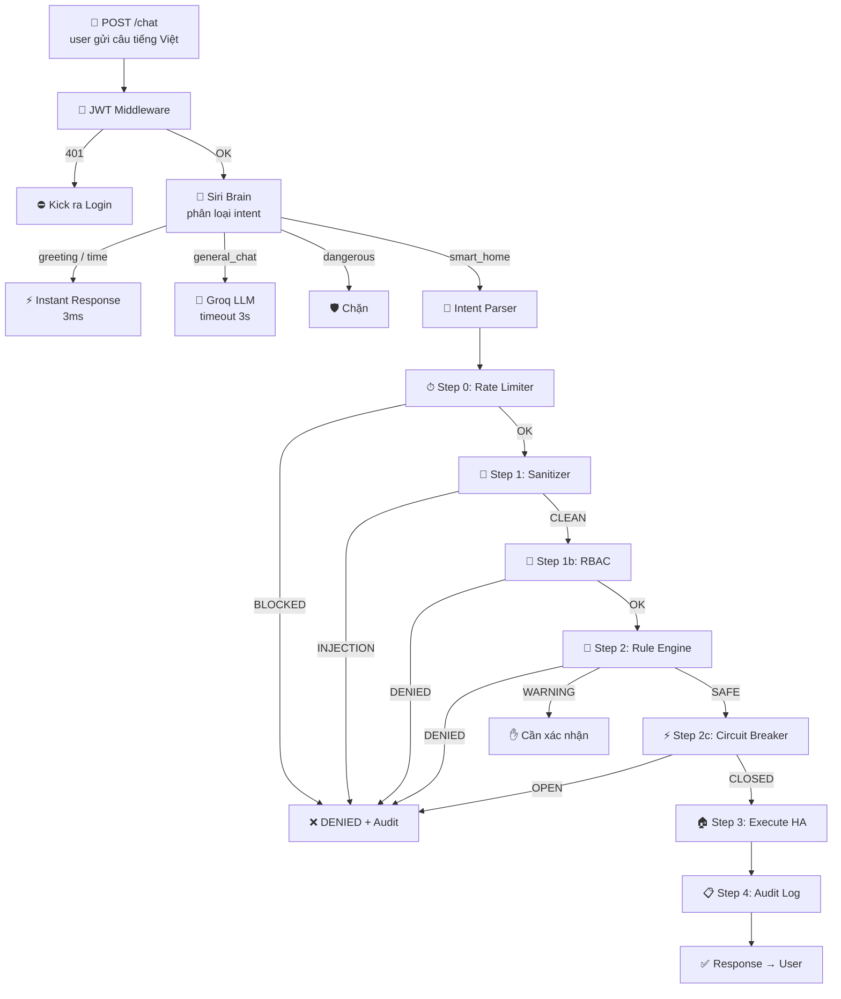
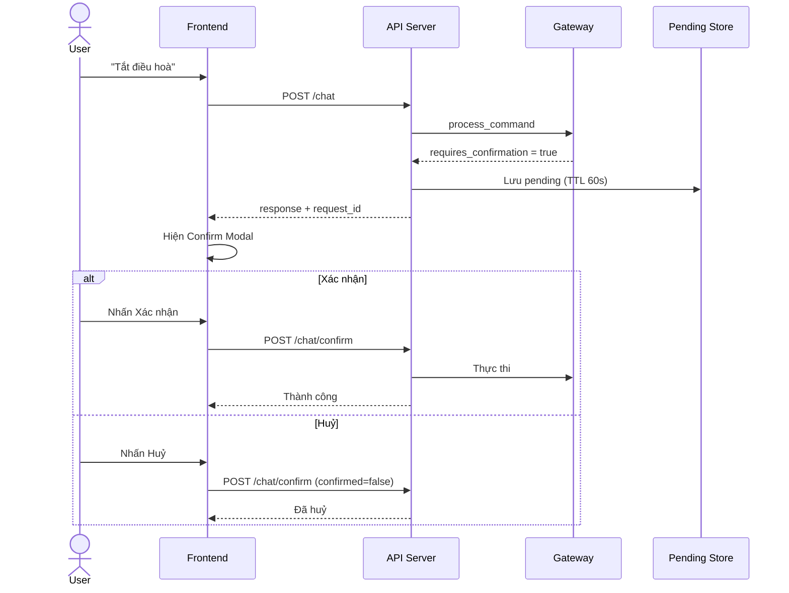
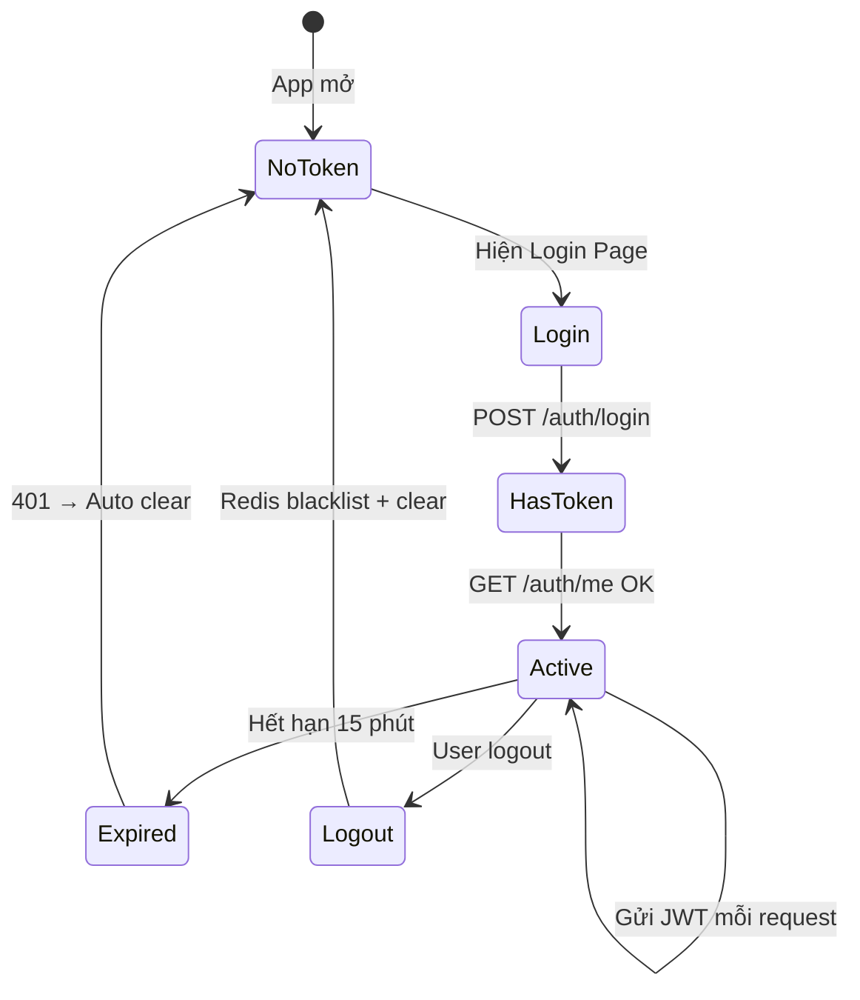

# 🗺️ Workflow — Luồng Xử Lý Aisha

> Sơ đồ theo dõi tiến trình từng request đi qua hệ thống.

---

## 1. Tổng Quan — User Flow

---

## 2. Security Gateway Pipeline — 6 Lớp Bảo Mật

---

## 3. Confirmation Flow — Lệnh Nguy Hiểm

---

## 4. RBAC — Bảng Phân Quyền

| Entity            | Action                    |      👑 Owner       |  👤 Guest   |
| ----------------- | ------------------------- | :-----------------: | :---------: |
| `light.*`         | turn_on/off, brightness   |         ✅          |     ✅      |
| `light.*`         | set_color                 |         ✅          |     ❌      |
| `sensor.*`        | get_state                 |         ✅          |     ✅      |
| `climate.*`       | set_temperature, turn_off |    ✅ ⚠️ confirm    |     ❌      |
| `lock.*`          | lock                      |         ✅          |     ❌      |
| `lock.*`          | unlock                    | ❌ (chặn tuyệt đối) |     ❌      |
| `switch.kitchen*` | turn_off                  |    ✅ ⚠️ confirm    |     ❌      |
| `switch.kitchen*` | turn_on                   | ❌ (chặn tuyệt đối) |     ❌      |
| Audit log         | xem                       |         ✅          | ❌ (ẩn tab) |

---

## 5. Token Lifecycle

